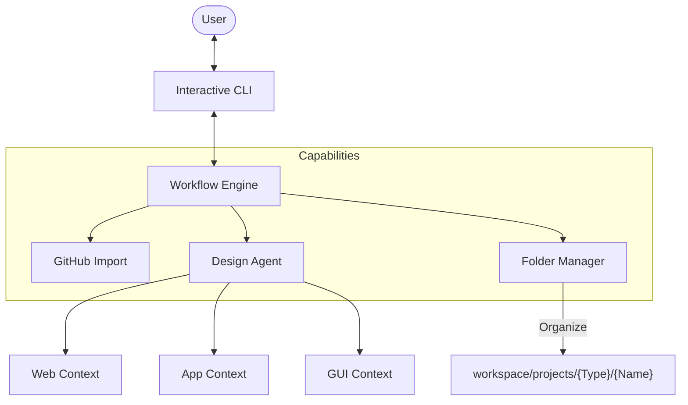

# 🤖 OpenManus (Interactive Edition)
> **Agentic AI Coding Assistant** with **Vibe Coding** Workflow


**OpenManus Interactive**는 추상적인 아이디어를 실행 가능한 **AI-Ready Context Package**로 변환하는 지능형 설계 에이전트입니다.
단순한 코드 생성을 넘어, **기존 프로젝트의 수정(Clone & Evolve)**과 **다양한 플랫폼(Web/App/GUI)** 설계를 지원합니다.

---

## ✨ Key Features

### 🐙 Clone & Evolve (New!)
- **GitHub Import**: 기존 레포지토리를 가져와서 분석하고 수정합니다.
- **Contextual Analysis**: 에이전트가 기존 코드의 구조를 이해하고 "Vibe"에 맞춰 발전시킵니다.

### 🧠 Intelligent Design Flow
- **Interactive Workflow**: 요구사항 → 백엔드 → 프론트엔드 → 통합 → 검토
- **Real-time Feedback**: "MySQL 말고 SQLite로 변경해"와 같은 자연어 수정을 즉시 반영합니다.
- **Architectural Planning**: 단순 코드가 아닌 전체 시스템 아키텍처를 설계합니다.

### 🎨 Diverse Project Support
- **🌐 Web**: React, Next.js, FastAPI, Node.js
- **📱 App**: React Native, Flutter, Expo
- **🖥️ GUI**: PyQt, Tkinter, WinForms for Desktop

---

## 🚀 Getting Started

### Prerequisites
- Python 3.11+
- [MCP Server](https://modelcontextprotocol.io/) (Optional)

### Installation
```bash
# 1. Clone the repository
git clone https://github.com/mannaandpoem/OpenManus.git
cd OpenManus

# 2. Setup Virtual Environment (Python 3.11 Recommended)
py -3.11 -m venv .venv

# 3. Install dependencies
.venv\Scripts\activate
pip install -r requirements.txt

# 4. Configure environment
copy config/config.example.toml config/config.toml
# Open config/config.toml and set your API key
```

## 💻 Usage (Interactive Mode)

Use the provided batch script for easy execution:

```bash
run.bat
```

Or manually:
```bash
.venv\Scripts\python run_interactive.py
```


---

## 💻 Usage (Interactive Mode)

대화형 마법사를 통해 프로젝트를 시작하세요.

```bash
python run_interactive.py
```

### 1단계: 프로젝트 소스 선택
```
📦 프로젝트 소스 선택:
   1. ✨ 새 프로젝트 만들기 (Scaffolding)
   2. 🐙 GitHub 레포지토리 가져오기 (Clone & Evolve)
```

### 2단계: 프로젝트 타입 선택
```
🚀 프로젝트 타입 선택:
   1. 🌐 Web Application
   2. 📱 Mobile App
   3. 🖥️ GUI / Desktop Form
```

---

## 🏗️ System Architecture



---

## 💡 Vision

**"Code with Vibe, Build with Intent."**
Manus Interactive는 당신의 의도를 가장 빠르고 정확하게 소프트웨어로 구현합니다.

---

<div align="center">
  <sub>Open Source Project based on OpenManus</sub>
</div>
