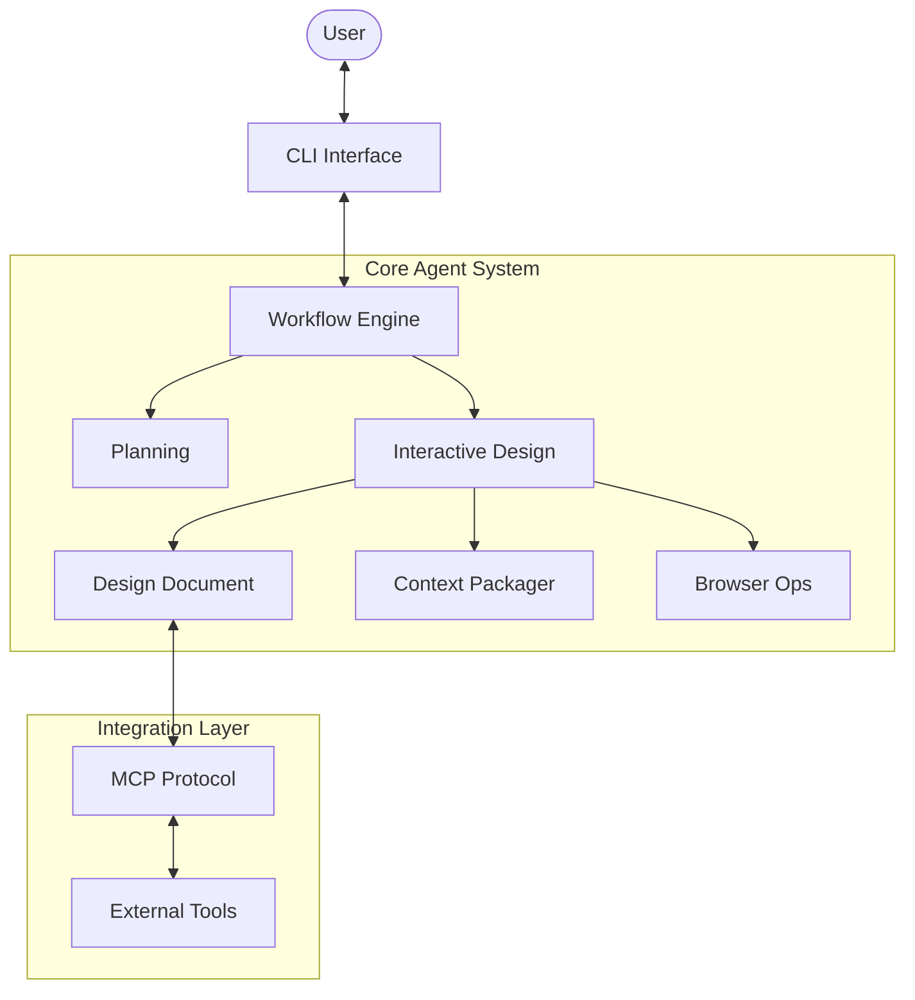

# 🌸 Jeongong Bloom (정공블룸)
> **AI-Powered Vibe Coding Assistant** for Next-Gen Development


**Jeongong Bloom**은 단순한 코딩 도구가 아닌, 추상적인 아이디어를 실행 가능한 **AI-Ready Context Package**로 변환하는 지능형 설계 에이전트입니다.

---

## ✨ Key Features

### 🧠 Intelligent Design Flow
- **5-Step Interactive Workflow**: 요구사항 → 백엔드 → 프론트엔드 → 통합 → 최종 검토
- **Real-time Feedback**: "MySQL 말고 SQLite로 변경해"와 같은 자연어 명령 즉시 반영
- **Architectural Planning**: 단순 코드가 아닌 전체 시스템 아키텍처를 설계

### 🛠 Powerful Capabilities
- **Modular Agent System**: ReAct 패턴 기반의 확장 가능한 에이전트 구조
- **MCP Integration**: Model Context Protocol을 통한 외부 도구/서버 연결 지원
- **Browser Automation**: 웹 탐색 및 조사를 위한 브라우저 에이전트 내장
- **Isolated Workspaces**: 프로젝트별 독립적인 작업 공간 자동 생성

---

## 🚀 Getting Started

### Prerequisites
- Python 3.11+
- [MCP Server](https://modelcontextprotocol.io/) (Optional)

### Installation

```bash
# 1. Clone the repository
git clone https://github.com/your-username/jeongong-bloom.git
cd jeongong-bloom

# 2. Install dependencies
pip install -r requirements.txt

# 3. Configure environment
cp config/config.example.toml config/config.toml
# Edit config.toml with your API keys
```

### Usage

**Interactive Mode (Recommended)**
```bash
python run_bloom.py
```
> 실행 후 프로젝트 이름을 입력하면, 전용 워크스페이스에서 설계가 시작됩니다.

**General Task Mode**
```bash
python main.py --prompt "Create a Todo List app with FastAPI" --project "todo_v1"
```

---

## 🏗️ System Architecture

Jeongong Bloom은 모듈성과 확장성을 최우선으로 설계되었습니다.



### Directory Structure

| Module | Description |
|--------|-------------|
| `app/agent` | **Core Logic**. ReAct & ToolCall Agents implementation |
| `app/tool`  | **Capabilities**. File ops, Browser, Context Packaging |
| `app/flow`  | **Orchestration**. Managing multi-step workflows |
| `app/mcp`   | **Connectivity**. Protocol for external tools |

---

## 💡 Why "Vibe Coding"?

코딩은 더 이상 문법과의 싸움이 아닙니다. **흐름(Vibe)**과 **의도(Intent)**의 표현입니다.
Jeongong Bloom은 당신의 '바이브'를 이해하고, 이를 정교한 소프트웨어 아키텍처로 구현합니다.

---

<div align="center">
  <sub>Built with ❤️ by Jeongong Bloom Team</sub>
</div>
